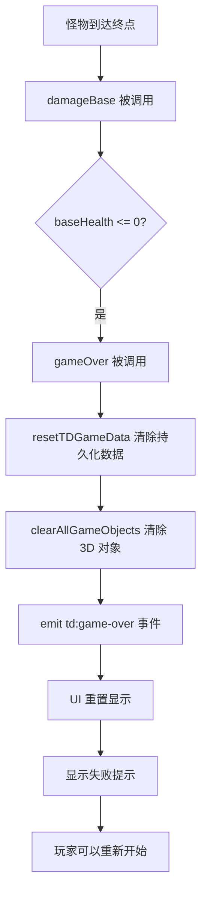
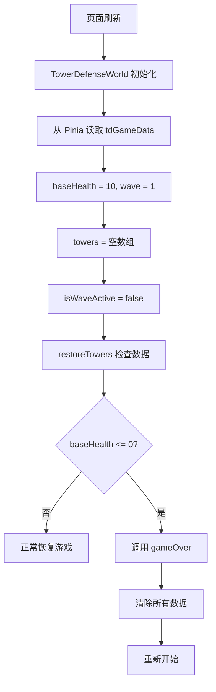

# 游戏失败后重置问题修复

## 🐛 问题描述

**Bug**：当外城游戏失败（基地血量为 0）后，刷新页面会导致游戏一直处于战斗状态，无法重新开始。

**原因**：
1. `gameOver()` 方法只清除了 3D 对象（敌人、子弹），但没有清除持久化数据
2. Pinia 的 `tdGameData` 中保存了 `isWaveActive = false` 和 `baseHealth = 0`
3. 刷新后，`restoreTowers()` 检测到 `baseHealth = 0`，但没有触发重置逻辑
4. UI 显示波次按钮，但内部状态混乱

## ✅ 修复方案

### 1. **完善 `gameOver()` 方法**

```javascript
gameOver() {
  console.log('💀 游戏失败，清除所有外城数据')
  this.isWaveActive = false

  // ===== 关键修复：完全重置外城数据 =====
  this.gameState.resetTDGameData()  // 清除持久化数据
  
  // 清除所有 3D 对象
  this.clearAllGameObjects()

  this.experience.eventBus.emit('td:game-over')
  this.experience.eventBus.emit('toast:add', {
    message: '基地被摧毁！防守失败，游戏将重新开始',
    type: 'error',
    duration: 5000,
  })
}
```

### 2. **新增 `clearAllGameObjects()` 方法**

```javascript
clearAllGameObjects() {
  console.log('清除所有游戏对象...')
  
  // 清除所有敌人
  while (this.enemies.length > 0) {
    this.removeEnemy(0)
  }
  
  // 清除所有子弹
  while (this.projectiles.length > 0) {
    this.removeProjectile(0)
  }
  
  // 清除所有防御塔
  this.clearAllTowers()
  
  // 重置本地状态
  this.wave = 1
  this.baseHealth = 10
  this.enemiesToSpawn = []
  this.waveComposition = []
  this.isInitialLoad = true
  
  console.log('所有游戏对象已清除')
}
```

### 3. **在 `restoreTowers()` 中添加失败检测**

```javascript
// ===== 修复：检查基地血量 =====
// 如果基地血量为 0，说明游戏已失败，应该重置所有数据
if (this.baseHealth <= 0) {
  console.warn('检测到基地血量为 0，游戏已失败，清除所有外城数据')
  this.gameOver()
}
```

### 4. **更新 UI 层的 `handleGameOver()`**

```javascript
function handleGameOver() {
  console.log('UI: 游戏失败，重置所有数据')
  // 重置为初始值
  isWaveActive.value = false
  wave.value = 1
  baseHealth.value = 10
  enemiesRemaining.value = 0
  
  // 清除选中状态
  gameState.setSelectedTower(null)
  gameState.setSelectedPosition(null)
}
```

## 🔄 完整的失败处理流程

### 场景1：游戏失败（实时）



### 场景2：失败后刷新页面



## 📋 测试场景

### 测试1：游戏失败立即重置
1. 开始游戏
2. 让怪物到达终点，直到 `baseHealth = 0`
3. **期望**：看到"基地被摧毁"提示
4. **期望**：所有敌人、子弹、防御塔消失
5. **期望**：波次重置为 1，血量重置为 10
6. **期望**：可以点击"开始下一波"重新开始

### 测试2：失败后刷新页面
1. 让游戏失败（`baseHealth = 0`）
2. 刷新页面
3. 切换到外城
4. **期望**：地图干净，没有防御塔
5. **期望**：波次显示为 1，血量显示为 10
6. **期望**：可以正常开始新游戏

### 测试3：失败后关闭浏览器再打开
1. 让游戏失败
2. 关闭浏览器
3. 重新打开浏览器，访问游戏
4. 切换到外城
5. **期望**：游戏从头开始（因为持久化数据已重置）

## 🔧 涉及的文件

1. **`src/js/td/tower-defense-world.js`**
   - 修改 `damageBase()`: 确保 `baseHealth` 不为负数
   - 修改 `gameOver()`: 调用 `resetTDGameData()` 清除持久化数据
   - 新增 `clearAllGameObjects()`: 清除所有游戏对象
   - 修改 `restoreTowers()`: 添加失败检测逻辑
   - 废弃 `resetGame()`: 使用 `clearAllGameObjects()` 代替

2. **`src/components/td/TowerDefenseUI.vue`**
   - 修改 `handleGameOver()`: 重置 UI 状态并清除选中
   - 修改 `handleWaveStarted()`: 正确计算 `enemiesRemaining`

3. **`src/stores/useGameState.js`**
   - 已有 `resetTDGameData()`: 重置外城所有持久化数据

## 💡 设计理念

### 数据一致性
- **持久化数据**（Pinia）和 **3D 对象**（Three.js）必须同步
- 失败时，两者都要清除

### 自动恢复机制
- `restoreTowers()` 中检查 `baseHealth`，自动触发失败逻辑
- 防止用户刷新后进入"僵尸状态"

### 清晰的反馈
- 显示明确的失败提示
- 告知玩家"游戏将重新开始"
- 5 秒的提示持续时间，足够用户看清

## 🎯 后续优化建议

### 1. 失败动画
```javascript
gameOver() {
  // 播放失败动画
  this.playGameOverAnimation()
  
  // 延迟 2 秒后清除数据
  setTimeout(() => {
    this.gameState.resetTDGameData()
    this.clearAllGameObjects()
  }, 2000)
}
```

### 2. 失败统计
```javascript
gameOver() {
  // 记录失败数据
  const stats = {
    wave: this.wave,
    towersBuilt: this.towers.length,
    creditsEarned: this.gameState.totalEarnedCredits,
    failTime: new Date().toISOString(),
  }
  
  // 保存到历史记录
  this.gameState.addGameHistory(stats)
}
```

### 3. 复活机制
```javascript
gameOver() {
  // 提供一次复活机会（消耗大量金币）
  if (this.gameState.credits >= 1000) {
    this.experience.eventBus.emit('ui:show-revive-dialog')
  } else {
    // 直接失败
    this.resetAllData()
  }
}
```

### 4. 难度调整
```javascript
gameOver() {
  // 连续失败多次，提示降低难度
  const failCount = this.gameState.tdFailCount || 0
  
  if (failCount >= 3) {
    this.experience.eventBus.emit('ui:suggest-difficulty-decrease')
  }
  
  this.gameState.setTDFailCount(failCount + 1)
}
```

## ✅ 验证清单

- [x] 游戏失败时清除所有 3D 对象
- [x] 游戏失败时清除持久化数据
- [x] 游戏失败时重置 UI 显示
- [x] 刷新后检测失败状态，自动重置
- [x] 显示明确的失败提示
- [x] 可以重新开始游戏
- [x] 不会出现"僵尸状态"（一直处于战斗中）

## 🔍 调试日志

失败时的控制台输出：
```
💀 游戏失败，清除所有外城数据
清除所有游戏对象...
清除所有防御塔，当前数量: 5
所有防御塔已清除
所有游戏对象已清除
UI: 游戏失败，重置所有数据
```

刷新后的控制台输出：
```
正在恢复 0 个防御塔...
没有需要恢复的防御塔
防御塔恢复完成，当前共有 0 个防御塔
检测到基地血量为 10，游戏状态正常
```

如果基地血量为 0（不应该出现）：
```
检测到基地血量为 0，游戏已失败，清除所有外城数据
💀 游戏失败，清除所有外城数据
...
```

